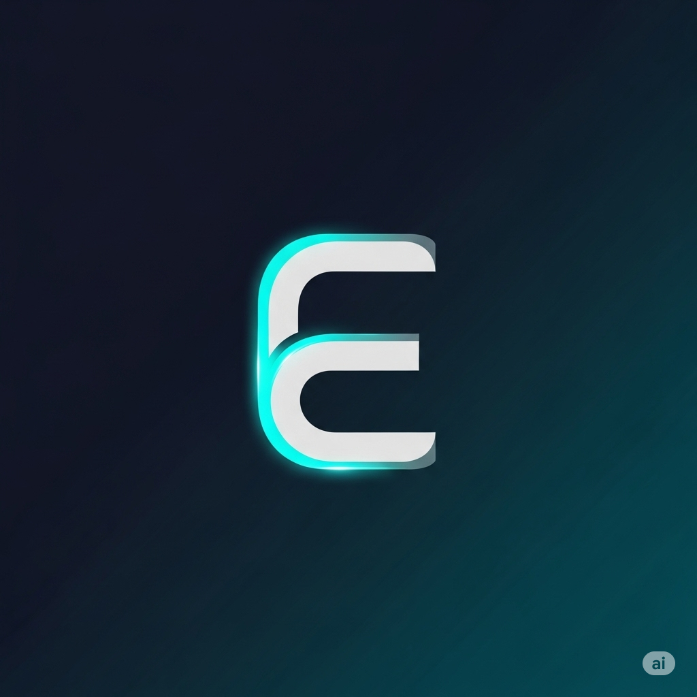

<div align="center">
  
  <h1 style="border-bottom: none;">Echo</h1>
  <strong>Your Personal AI Health Companion</strong>
</div>

<p align="center">
  
  
  
  
</p>

---

## 🚀 Overview

**Echo** is an innovative platform designed for the modern healthcare landscape, acting as a bridge between patients and medical professionals. At its core is **Aegis**, a sophisticated AI agent that leverages a patient's health history and current symptoms to provide intelligent, personalized health insights.

From analyzing symptoms to automatically scheduling doctor's appointments, Echo streamlines the entire process of seeking care. It's more than just an app; it's a proactive health companion dedicated to making healthcare simpler, smarter, and more accessible for everyone.

## ✨ Key Features

Echo offers a suite of powerful features managed by our intelligent agent, **Aegis**:

*   **🩺 Intelligent Symptom Analysis:** Describe your symptoms in natural language or upload a report. Aegis analyzes the information against your medical history to provide a preliminary overview.
*   **📊 Personalized Health Reports:** Receive a detailed report containing:
    *   An overview of your current condition.
    *   A visual graph of probable illnesses.
    *   Personalized recommendations for wellness.
    *   Suggested treatments and medications, cross-referenced to avoid side effects based on your known history.
*   **📂 Secure Document Hub:** Upload, scan, and manage all your medical files—from lab results to prescriptions—in one secure, centralized location.
*   **🏥 Find Nearby Healthcare:** Aegis automatically locates the nearest and most relevant doctors, clinics, and hospitals based on your needs and location.
*   **🗓️ Seamless Calendar Integration & Scheduling:**
    *   Aegis has secure access to your personal calendar to find your free time slots.
    *   It contacts clinics on your behalf to book an appointment that works for you.
    *   The confirmed appointment is automatically added to your calendar.
*   **🕰️ Health Timeline:** View a chronological record of your past reports, consultations, and health events.

## 🤖 Meet Aegis: The Core AI

**Aegis** is the intelligence behind Echo. It's designed to handle complex tasks with a human-centric approach:

1.  **Listens & Understands:** Processes user input, whether it's text, voice, or a document.
2.  **Analyzes & Correlates:** Connects current symptoms with past medical data for deeper insights.
3.  **Acts & Assists:** Takes proactive steps like finding a doctor and booking an appointment.
4.  **Learns & Improves:** Continuously learns from interactions to provide more personalized and accurate assistance over time.

## 🛠️ Technology Stack

This project is built with a modern, robust technology stack to ensure a scalable and responsive application.

| Area      | Technology                                                                                             |
| --------- | ------------------------------------------------------------------------------------------------------ |
| **Backend** |    |
| **Frontend**|         |
| **Database**|                                                                                              |
| **Deployment**|                                                                                               |

## ⚙️ Getting Started

To get a local copy up and running, follow these simple steps.

### Prerequisites

*   Node.js & npm
*   Python 3.10+ & Pip
*   Git

### Installation & Setup

1.  **Clone the repository:**
    ```sh
    git clone https://github.com/kiarash-ai/ECHO.git
    cd ECHO
    ```

2.  **Backend Setup (Django):**
    ```sh
    cd backend
    pip install -r requirements.txt
    python manage.py migrate
    python manage.py runserver
    ```

3.  **Frontend Setup (React):**
    ```sh
    cd frontend
    npm install
    npm start
    ```
    Your application should now be running on `http://localhost:3000`.

## 🗺️ Future Roadmap

We have a bold vision for Echo. Here are some features we're excited to explore next:

*   [ ] **Real-time Telemedicine Integration:** Connect with doctors directly through the app.
*   [ ] **Wearable Device Sync:** Integrate with smartwatches and fitness trackers for holistic health monitoring.
*   [ ] **Pharmacy Integration:** Send prescriptions directly to the user's preferred pharmacy.
*   [ ] **Advanced AI:** Implement predictive analytics for potential health risks based on long-term data trends.

---

<div align="center">
  <p>Built with ❤️ for a healthier future.</p>
  <p><strong>Disclaimer:</strong> Echo is a supportive tool and does not provide professional medical advice. Always consult with a qualified healthcare provider for any medical concerns.</p>
</div>